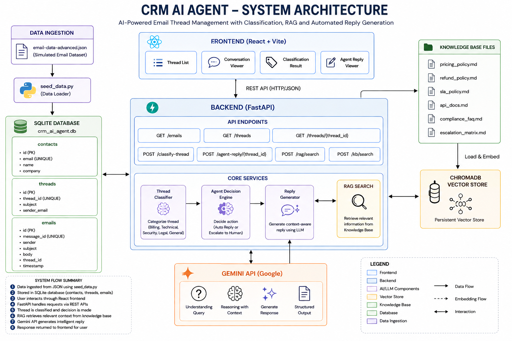
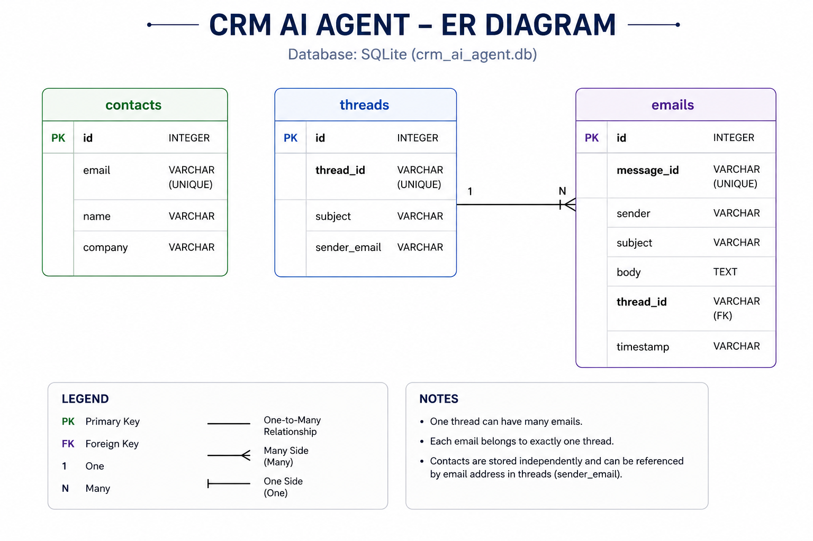

# CRM AI Agent

AI-powered CRM Support Agent built using FastAPI, React, Gemini, SQLite, and ChromaDB.

The system ingests customer emails, classifies support requests, retrieves relevant company policies through Retrieval-Augmented Generation (RAG), determines the correct action, and generates AI-powered support responses.

---

# Features

## Email Ingestion

* Loads customer emails from dataset
* Stores emails in SQLite database
* Groups emails into conversation threads

## Thread Classification

Classifies support conversations into:

* Billing
* Technical
* Security
* Legal
* General

Also determines:

* Urgency
* Sentiment
* Human escalation requirement

## RAG Knowledge Retrieval

Retrieves company knowledge from:

* Pricing Policy
* Refund Policy
* SLA Policy
* API Documentation
* Compliance FAQ
* Escalation Matrix

Uses:

* ChromaDB
* Sentence Transformers

## Agent Decision Engine

Decides whether to:

* Auto Reply
* Escalate to Human Agent

Based on:

* Classification
* Urgency
* Sentiment
* Escalation rules

## AI Reply Generation

Uses Google Gemini to generate:

* Customer support replies
* Refund responses
* Technical responses
* Escalation responses

## Frontend Dashboard

React dashboard displaying:

* Email threads
* Conversation history
* Classification results
* Agent decisions
* Generated replies

---

# Tech Stack

## Backend

* Python
* FastAPI
* SQLAlchemy
* SQLite
* ChromaDB
* Sentence Transformers
* Google Gemini

## Frontend

* React
* Vite
* Axios

---

# Project Structure

```text
crm-ai-agent/

backend/
│
├── models/
├── routes/
├── services/
├── vector_db/
│
frontend/
│
├── src/
│   ├── pages/
│   ├── components/
│   └── services/
│
knowledge_base/
│
├── pricing_policy.md
├── refund_policy.md
├── sla_policy.md
├── api_docs.md
├── compliance_faq.md
└── escalation_matrix.md
│
diagrams/
│
├── architecture_diagram.png
└── er_diagram.png
│
schema.sql
openapi.json
seed_data.py
email-data-advanced.json
README.md
```

---

# Installation

## Clone Repository

```bash
git clone https://github.com/Omdurge/crm-ai-agent.git
cd crm-ai-agent
```

---

# Backend Setup

Create virtual environment:

```bash
python -m venv venv
```

Activate virtual environment:

### Windows

```bash
venv\Scripts\activate
```

Install backend dependencies:

```bash
pip install -r backend/requirements.txt
```

---

# Environment Variables

Create a `.env` file in the project root:

```env
GOOGLE_API_KEY=YOUR_GEMINI_API_KEY
```

---

# Seed Database

Populate SQLite database with sample email data:

```bash
python seed_data.py
```

---

# Build Vector Database

Index the knowledge base documents:

```bash
curl http://127.0.0.1:8000/rag/index
```

or invoke the indexing route directly through FastAPI.

---

# Run Backend

```bash
uvicorn backend.main:app --reload
```

Backend URL:

```text
http://127.0.0.1:8000
```

Swagger Documentation:

```text
http://127.0.0.1:8000/docs
```

OpenAPI Specification:

```text
http://127.0.0.1:8000/openapi.json
```

---

# Frontend Setup

Move to frontend:

```bash
cd frontend
```

Install dependencies:

```bash
npm install
```

Run development server:

```bash
npm run dev
```

Frontend URL:

```text
http://localhost:5173
```

---

# Available APIs

## Email APIs

```text
GET /emails
GET /threads
GET /threads/{thread_id}
```

## Classification APIs

```text
GET /classify/{message_id}
GET /classify-thread/{thread_id}
```

## Agent APIs

```text
GET /agent/{thread_id}
GET /agent-reply/{thread_id}
```

## Knowledge Base APIs

```text
GET /kb/search
GET /rag/search
GET /rag/index
```

---

# Architecture Diagram

The complete architecture diagram is available below:



System Flow:

```text
Email Dataset
      ↓
SQLite Database
      ↓
FastAPI Backend
      ↓
Thread Classification
      ↓
Agent Decision Engine
      ↓
RAG Retrieval
      ↓
ChromaDB
      ↓
Gemini LLM
      ↓
Generated Reply
      ↓
React Dashboard
```

---

# Entity Relationship Diagram

The database ER diagram is available below:



Database Entities:

## Contacts

Stores customer information.

Fields:

* id
* email
* name
* company

## Threads

Stores conversation threads.

Fields:

* id
* thread_id
* subject
* sender_email

## Emails

Stores individual email messages.

Fields:

* id
* message_id
* sender
* subject
* body
* thread_id
* timestamp

Relationships:

* One Thread contains many Emails
* Contacts participate in Threads through email correspondence

---

# SQL Schema

The complete SQL schema is available in:

```text
schema.sql
```

Tables:

* contacts
* threads
* emails

Database Engine:

```text
SQLite
```

Vector Storage:

```text
ChromaDB
```

Location:

```text
backend/vector_db/
```

ChromaDB stores:

* document embeddings
* vector indexes
* retrieval metadata

---

# OpenAPI Specification

The project includes an exported OpenAPI specification.

File:

```text
openapi.json
```

Swagger UI:

```text
http://127.0.0.1:8000/docs
```

Generated OpenAPI Endpoint:

```text
http://127.0.0.1:8000/openapi.json
```

---

# Knowledge Base Documents

The RAG pipeline is seeded using:

* pricing_policy.md
* refund_policy.md
* sla_policy.md
* api_docs.md
* compliance_faq.md
* escalation_matrix.md

These files are indexed into ChromaDB and retrieved during agent reasoning.

---

# Known Limitations

* SQLite used instead of production-grade database
* ChromaDB stored locally
* Email ingestion uses simulated dataset
* Basic heuristic classification logic
* Limited sentiment analysis
* No authentication system
* No role-based access control
* No ticket ownership workflow
* No production deployment pipeline
* Limited web intelligence integration

---

# Future Improvements

* PostgreSQL support
* Authentication & Authorization
* Real email integrations
* Human-in-the-loop review
* Multi-agent workflows
* Analytics dashboard
* Ticket assignment engine
* Cloud deployment
* Feedback learning loop

---

# Deliverables Implemented

| Deliverable            | Status    |
| ---------------------- | --------- |
| GitHub Repository      | Completed |
| README Documentation   | Completed |
| Architecture Diagram   | Completed |
| Knowledge Base Files   | Completed |
| ER Diagram             | Completed |
| SQL Schema             | Completed |
| OpenAPI Specification  | Completed |
| FastAPI Backend        | Completed |
| React Dashboard        | Completed |
| RAG Pipeline           | Completed |
| Agent Reasoning Engine | Completed |
| AI Reply Generation    | Completed |

---

# Notes

The project uses ChromaDB as an external vector database. Embeddings are stored in ChromaDB rather than inside SQLite tables.

Database migrations are not implemented. Tables are generated through SQLAlchemy models and initialized automatically.

---

# Authors
Varun Gaikwad

Vishwakarma Institute of Technology, Pune

CRM AI Agent Project
